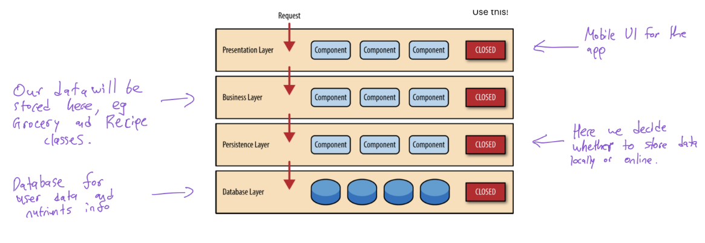

# Grocery & Recipe Management App

## Relevant links
- [Installation instructions](https://git.uwaterloo.ca/f48yu/FJDK/-/wikis/Installation-Instructions)
- [Software releases](https://git.uwaterloo.ca/f48yu/FJDK/-/releases)

## Project Plan

### Goals:

We are trying to create a grocery and recipe management app for young adults to
help them track the groceries they have and get recipes they can make with the
groceries they have.

### Resources:

We have 4 people, no restraints on the time and availability outside of what is
expected within a course environment.

### Risks:

- None of us have programmed in Kotlin before. **Mitigation:** We learn it as
  soon as possible and have realistic goals based on our experience.
- 2 of our developers are commuting to school this term, which may limit
  in-person availability. **Mitigation:** We will setup our workflow to be
  asynchronous and remote.
- The APIs we're using to source our data may be incomplete (eg. USDA food info
  does not contain a complete list of UPC barcodes). **Mitigation:** We have a
  limited barcode feature, or hardcode some missing data we find.

### Milestones:

1. Sprint 1:
    - We should have basic storage functionality for grocery items and recipes.
    - Establish the backend and APIs we'll use.
    - We connect the recipes to the grocery items so we can view which recipes we are able to make.
2. Sprint 2:
    - Should have a UI to view the groceries and recipes
    - Create your own recipes and add them to the list
    - Should be able to see which items are missing in each recipe
        - Be able to create a grocery list based on the missing items
    - Saving recipes into collections
3. Sprint 3:
    - Adding community features
        - Sharing recipes with others
        - Creating "households" so more than one person can view your inventory and
          you can have more than one inventory
    - Add nutrient info to each of the foods and recipes

## Requirements

### Problem

- We are trying to reduce food waste by making it easier for users to consume
  the ingredients they have. We want to create an easy way for users to
  manage their inventory across multiple kitchens like Home, Dorm room, etc. We also want
  to create a convenient way for them to manage their grocery shopping list

### Users

- We are specifically targeting young adults who are not used to cooking,
  shopping and planning meals for themselves.

User feedback from interviews

- Would use this, something minimalistic and not overwhelming to use
- Would want to track groceries they have, so they dont buy things they already have
- Share inventory with roommates/family etc, Dad buys groceries -> updates your inventory
- Multiple instances, for example one instance for uni residence with roomates, one for home with immediate family

### Functional Requirements Completed

1. Sign up and login flow
2. Ability to view a grocery list of items to purchase
3. Ability to mark items as purchased or delete them
4. Ability to view a kitchen of items in inventory
5. Ability to edit or consume items in inventory
6. Ability to invite users to kitchen
7. Ability to join a kitchen
8. Ability to view different kitchens

## Design

### System Diagram

We are using a monolithic architecture, with a rough outline of it shown below:

## Software Releases

- [Sprint 1](https://git.uwaterloo.ca/f48yu/FJDK/-/releases/sprint-1)
- [Sprint 2](https://git.uwaterloo.ca/f48yu/FJDK/-/releases/sprint-2)
- [Sprint 3](https://git.uwaterloo.ca/f48yu/FJDK/-/releases/sprint-3)
- [Sprint 4](https://git.uwaterloo.ca/f48yu/FJDK/-/releases/sprint-4)

## Reflections on practices

Throughout the project, we tried different techniques on getting things done. As things progressed
We realized that certain techniques and practices worked better than others. As the project progressed,
things naturally fell into place and by the end of it, we were in what we think is our optimal
working pattern. This is evident by us also making far more progress towards the end of the term.

We started by attempting an "everyone does a bit of everything" approach. We were all new to Kotlin and android development,
and we were all interested in trying a bit of everything. As time passed, we realized that
it was hard to simultaneously work on different parts of code, while transferring context and knowledge.

By the end of it, we were all working on different sections of the stack, and each person "owned" their section.
This included Front end, api connection, backend, etc.

In addtion, our work style shifted from sync to async. We started by setting things up in person, and
calling to determine our contracts, features, and how we plan on doing things. Eventually, as things got defined we mostly used what
contracts we had and simply pinged each other when we had questions.
We also didn't really pair program since each of us owned our own sections (not great for our bus factor) but we continued to review code.
Although our code reviews mostly resulted in feedback being sent directly in our discord or on call.

## Improvements

Going forward, this app can benefit from better UI decisions. Since none of us were experienced in
Product design or UI/UX design, we struggled the most on this.

Some improvements on our UI, had we had another sprint were to
- Allow users to edit list names
- Allow users to edit amounts in grocery items
- Manage users in your kitchen (Remove users, set up permissions, etc)

The API functionality for some of these exists, and for some would need to be created
The Front end capabilities would need to be developed for this

Additionally, some features we intended as stretch features, such as Recipes, could not be completed. These include
- Search
- Bulk edit
- Recipe suggestions based on ingredients
- Recipe integrations with grocery lists.

The API and Front End functionality for these stretch features does not exist.
We estimate that to complete the above, another 4 sprints would be needed.

## A Note About Unit Tests

Our unit tests are configured to run with the firebase credentials which is stored locally. For this reason, the tests
only pass on our local
machines, but not on CI.
